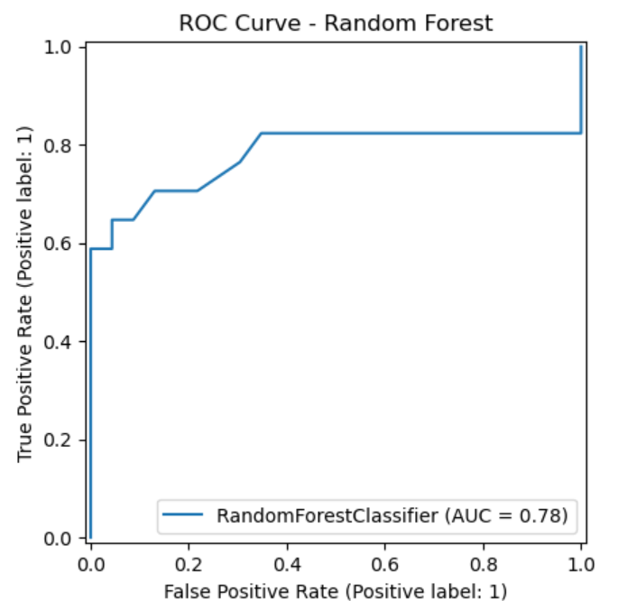
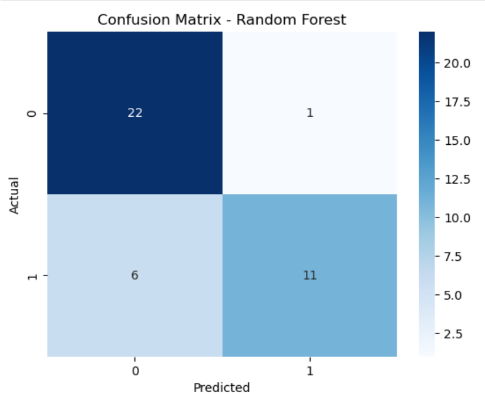
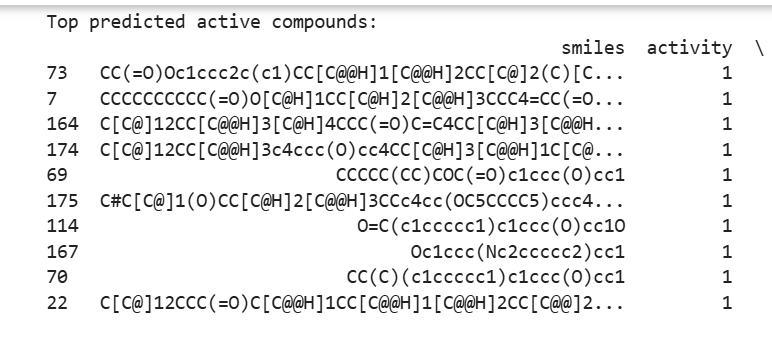
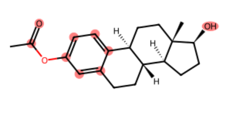
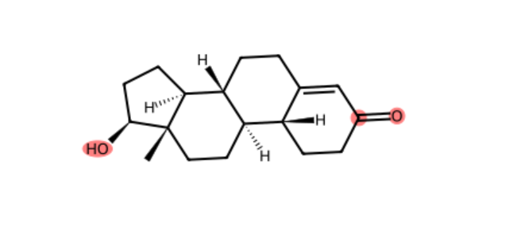

# QSAR_Endocrine_Project-
Computational toxicology project: Predicting endocrine disruption potential with interpretable molecular fingerprints.
## Objective
Predict whether a chemical is active at the estrogen receptor using SMILES and machine learning.
## Dataset
- Source: Tox21 ( NR-ER-LBD assays)
- Compounds: 199
- Columns: `smiles`, `activity` (1=active, 0=inactive)
- ## Methods
- Features: 1024-bit Morgan fingerprints (RDKit)
- Model: Random Forest (n_estimators=199)
- Train/test split: 80/20 stratified
 ## Model Evaluation
 The QSAR model was evaluated using standard classification metrics to assess its ability to distinguish active and inactive compounds. Model performance was assessed on a held-out test set to ensure generalizability and avoid overfitting.
## Results
ROC–AUC score: ~0.78. 

This indicates good classification performance, with the model able to reliably separate active from inactive compounds better than random guessing.The ROC curve demonstrates a favorable balance between sensitivity and specificity.
- Accuracy: 0.825
The model achieved an overall accuracy of ~82.5%, indicating strong predictive reliability for a structure-based QSAR model.
- Confusion Matrix: [[22, 1], [6, 11]] 
## Top Predicted Active Compounds

The model generated probability scores for all compounds in the test set. Compounds with the highest predicted probabilities were ranked to identify top predicted active molecules.
## Functional Group Highlights
Key functional groups were manually highlighted in the top predicted active compounds using RDKit visualization tools.

Highlighted features included:
- Aromatic rings (π-systems associated with receptor binding)
- Carbonyl groups (C=O) (common in bioactive scaffolds)
- Hydrogen-bond donors and acceptors (–OH, –NH groups)
The recurring presence of these functional groups suggests their potential role in mediating endocrine-disrupting activity.
## Conclusion
- A robust QSAR model was developed using molecular fingerprints and Random Forest classification.
- The model demonstrated strong predictive performance with ROC-AUC ≈ 0.78 and accuracy ≈ 82%.
- The model predicts estrogen receptor activity from molecular fingerprints, prioritizing chemicals that may act as endocrine disruptors before experimental testing. Highlighted functional groups and substructures provide interpretable insights into the chemical features contributing to these predictions.
- Top predicted active compounds were identified, structurally analyze, and the Functional groups visualized thus providing chemically meaningful interpretability of model predictions.
- This study highlights the value of combining machine learning with cheminformatics tools for toxicity and bioactivity prediction.
